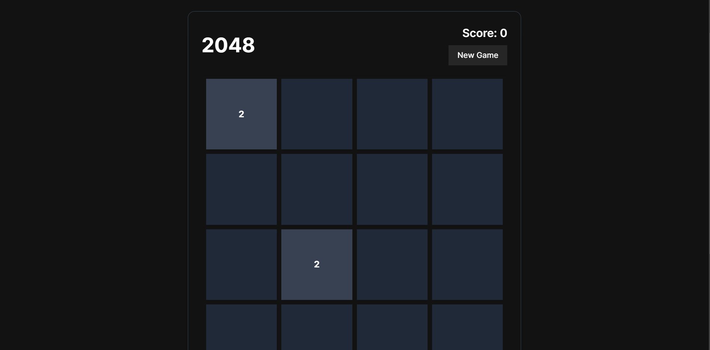
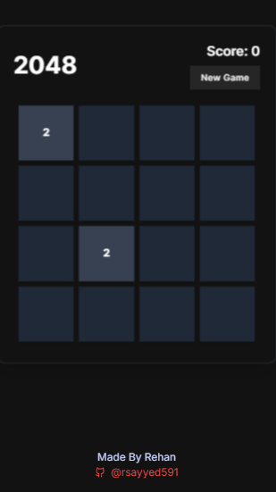

# **2048**

Welcome to the 2048 game project! This is a web-based implementation of the popular 2048 puzzle game, built using **Next.js** and **React** with **TypeScript**. The game allows players to combine tiles to reach the 2048 tile by sliding tiles in four directions.

## **Project Overview**

The project is structured as follows:

```
└── rsayyed591-2048/
    ├── README.md
    ├── components.json
    ├── eslint.config.mjs
    ├── next.config.ts
    ├── package.json
    ├── postcss.config.mjs
    ├── tailwind.config.ts
    ├── tsconfig.json
    ├── public/
    └── src/
        ├── app/
        │   ├── globals.css
        │   ├── layout.tsx
        │   └── page.tsx
        ├── components/
        │   ├── Game2048.tsx
        │   └── ui/
        │       ├── button.tsx
        │       ├── card.tsx
        │       ├── toast.tsx
        │       └── toaster.tsx
        ├── hooks/
        │   └── use-toast.ts
        └── lib/
            └── utils.ts
```

## **Features**

- **Game Mechanics**: 
  - Slide tiles to combine matching numbers and reach the 2048 tile.
  - Score tracking with tile merging.
  - Touch and keyboard support for controlling the game.
  
- **Technologies Used**:
  - **Next.js** (React framework)
  - **Tailwind CSS** (For styling)
  - **TypeScript** (For type safety)
  - **Framer Motion** (For animations)
  - **React-Confetti** (For confetti effect when the game is won)
  
## **Installation**

To get started with the project, follow these steps:

1. **Clone the repository:**

   ```bash
   git clone https://github.com/rsayyed591/2048.git
   ```

2. **Navigate to the project folder:**

   ```bash
   cd rsayyed591-2048
   ```

3. **Install dependencies:**

   If you're using npm:

   ```bash
   npm install
   ```

   Or, if you're using yarn:

   ```bash
   yarn install
   ```

4. **Start the development server:**

   ```bash
   npm run dev
   ```

   Or, with yarn:

   ```bash
   yarn dev
   ```

5. **Open your browser** and visit `http://localhost:3000`.

## **Screenshots**




*Example screenshot of the game interface.*

## **Demo**

You can try the live demo of the game here:  
[2048 Game Demo](https://gameof2048.vercel.app/)

## **Key Components**

1. **Game2048.tsx**:
   - The main game logic and grid rendering.
   - Handles tile movement, merging, and score updates.

2. **Button.tsx**:
   - A reusable button component used throughout the application, including for restarting the game.

3. **Card.tsx**:
   - A reusable card component used to display various UI elements, such as the score and game-over message.

4. **use-toast.ts**:
   - A custom hook for managing toast notifications.

5. **utils.ts**:
   - Utility functions to handle common tasks (e.g., generating random tiles).

## **Project Structure**

- `src/app/`: Contains the main app layout and pages.
- `src/components/`: Contains the core game components and UI elements.
- `src/hooks/`: Custom React hooks for state management and other reusable logic.
- `src/lib/`: Utility functions and helpers.

## **How to Contribute**

If you find any issues or want to improve the project, feel free to fork this repository and submit a pull request. Contributions are always welcome!

---

## **About the Developer**

This project is developed by **Rehan Feroz Sayyed**. Rehan is a computer engineering student from Mumbai, India, currently working on improving their web development skills, including proficiency in React, Next.js, TypeScript, and Tailwind CSS.

---

## **License**

This project is licensed under the MIT License - see the [LICENSE](LICENSE) file for details.